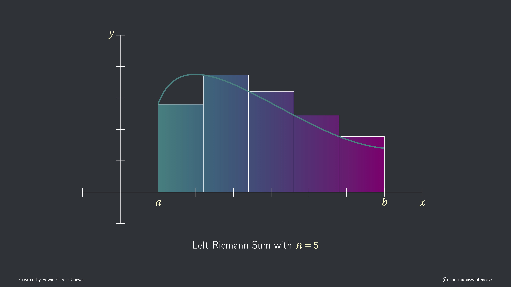
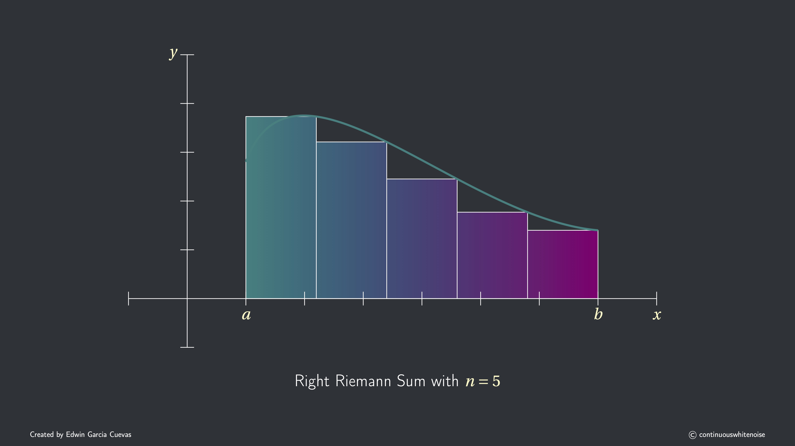
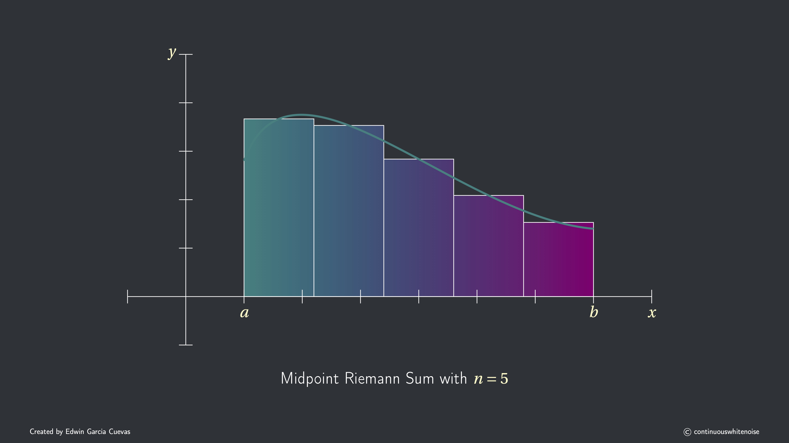
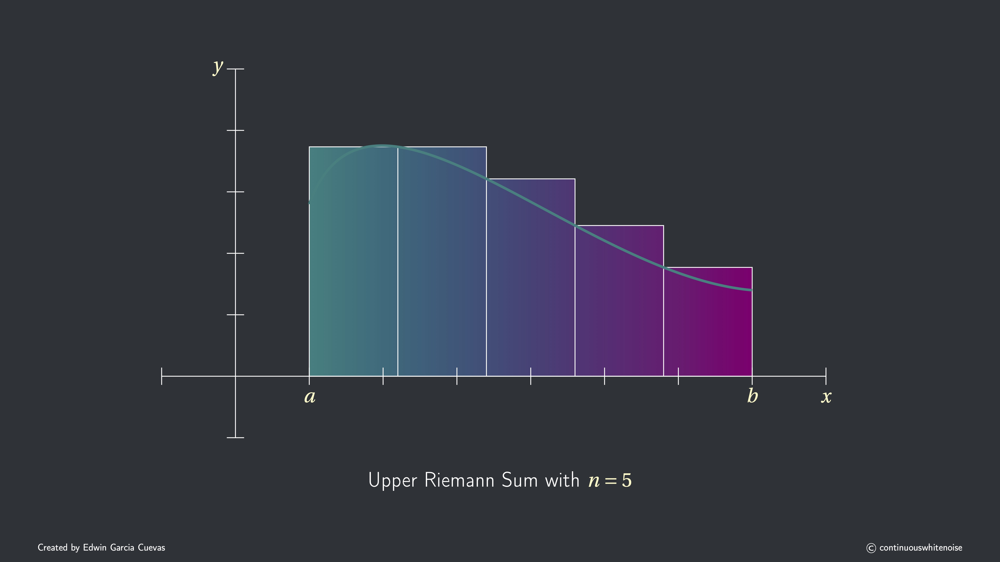
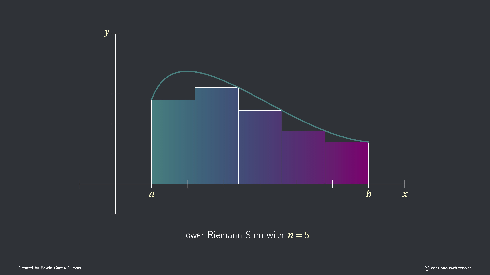

## Motivation and History

### Approximating Area and Length

The concept of integration stems back centuries. In fact, many cultures are now credited with inventing the idea independently. Perhaps the most famous examples are the ancient Greeks in their study of geometry.

Archimedes, born in 287 BCE in Syracuse, was a famous geometer and philosopher. Building on ideas developed earlier by Eudoxus of Cnidus, he used regular polygons to approximate the area and circumference of a circle. By inscribing and circumscribing polygons with more and more sides, he was able to obtain increasingly accurate approximations using a technique known as the *method of exhaustion*—an early idea that closely resembles the modern concept of limits and integration.

{fig-align="center" width="973"}

By the 17th century, mathematicians such as Isaac Newton and Gottfried Wilhelm Leibniz built upon these earlier ideas to develop what we now call **calculus**.

Independently, Newton and Leibniz developed methods based on the accumulation of **infinitesimal quantities**, allowing them to compute areas, volumes, and accumulated change. Although highly effective in practice, these methods lacked a fully rigorous mathematical foundation. In the 19th century, Bernhard Riemann provided a precise framework for integration by combining the intuitive idea of accumulation with the emerging concept of limits, thereby defining the integral as the limit of sums over increasingly fine partitions.

### Physics and Area Under a Curve

When Isaac Newton studied the motion of planetary objects, he developed mathematical tools to describe and predict such motion. In physics, we often work with quantities such as position, velocity, and acceleration, all of which typically depend on time.

A natural question arises: if we know the rate at which a quantity changes, can we recover the original quantity itself? This naturally leads to the concept of integration.

Although Newton could recover such quantities from their rates of change using geometric and infinitesimal reasoning, in a process we now call **antidifferentiation**, Riemann’s framework emphasized **accumulation** rather than directly reversing a rate of change. Nonetheless, it provides a rigorous foundation for recovering quantities from their rates of change.

As an example of an application of these ideas, suppose that the instantaneous velocity of a point particle as a function of time is known. Assume that the particle is allowed to move only along the $x$-axis (so it moves only left or right). We begin with the idea that

$$
    \text{displacement} \approx \text{velocity} \cdot \text{time}.
$$

If time $t$ is measured in *seconds* and velocity $v$ in *meters per second*, dimensional analysis confirms this relationship:

$$
    \text{velocity} \cdot \text{time}
    \quad\implies\quad
    \frac{\text{meters}}{\text{seconds}} \cdot \text{seconds}
    = \text{meters}.
$$

#### Net Change (Signed Accumulation)

To approximate the *net displacement* over the interval $[a,b]$, divide the time interval into $n$ subintervals of arbitrary lengths $\Delta t_k$. On each subinterval, we sample a time $t_k^*$ and approximate the velocity as constant. This gives that

$$
\begin{align*}
    \text{Net Displacement}
    &\approx v(t_1^*)\Delta t_1 + v(t_2^*)\Delta t_2 + \cdots + v(t_n^*)\Delta t_n \\
    &=\sum_{k=1}^{n} v(t_k^*)\,\Delta t_k.
\end{align*}
$$

Note that the velocity $v$ can take on negative values, so for net change, we preserve the sign to account for the particle’s direction of motion.

#### Total Change (Unsigned Accumulation)

If instead we are interested in the *total distance traveled*, we take the absolute value of the velocity:

$$
\begin{align*}
    \text{Total Distance}
    &\approx |v(t_1^*)|\Delta t_1 + |v(t_2^*)|\Delta t_2 + \cdots + |v(t_n^*)|\Delta t_n \\
    &= \sum_{k=1}^{n} |v(t_k^*)|\,\Delta t_k.
\end{align*}
$$

Here, we ignore the sign because we are interested in the total distance traveled.

In either case, these approximations arise from a finite *accumulation* of quantities over time. Geometrically, the accumulation can be interpreted as the **area under the curve** of the velocity function.

Of course, the physical meaning of the accumulated area depends on the quantity that $f(x)$ represents. For example, if

$$
f(x)=
    \begin{cases}
    \text{velocity},\\
    \text{acceleration},\\
    \text{force (as a function of position)},\\
    \text{linear density},
    \end{cases}
$$

then the area under the graph of $f$ represents

$$
    \begin{cases}
    \text{change in position},\\
    \text{change in velocity},\\
    \text{work done},\\
    \text{total mass},
    \end{cases}
$$

respectively.

## Riemann Sums

The previous example suggests a general strategy for approximating the area under the curve: break the interval into pieces, approximate locally, and sum. We now discuss Riemann's process of formalizing this idea for a well-behaved function $f$.

Suppose $f:[a,b] \to \mathbb{R}$ is a **bounded function**. The goal is to approximate its net accumulation over $[a,b]$, which geometrically corresponds to approximating the area under the graph of $f$ using a finite collection of rectangles.

The sum of the areas of these rectangles is called a *Riemann sum*. The construction proceeds in the following steps:

### Partitioning of $[a,b]$: The Rectangle Bases

Create a partition of the interval $[a,b]$ using points

$$
a = x_0 < x_1 < \dots < x_{n-1} < x_n,
$$\
to divide the interval into $n$ subintervals

$$
[x_0,x_1], \quad [x_1,x_2], \quad \dots\,, \quad [x_{n-1},x_n],
$$

which need not be of equal length.

Denote the **length** of the $k$-th subinterval as

$$
\Delta x_k = x_k - x_{k-1},
$$

representing the **width of the rectangle** over that interval.

The **longest** subinterval is called the *mesh* of the partition and is denoted as

$$
\max_{1 \le k \le n} \Delta x_k.
$$

If all subintervals have the same length, the partition is called **even** (or **uniform**), and the mesh reduces to the common stepsize, denoted simply by $\Delta x=\frac{b-a}{n}$.

> **Intuition**: In applications, we often choose the partition based on what is being approximated. For instance, when tracking a jet taking off, we might use smaller time steps at the beginning—when the jet's acceleration and forces are changing rapidly—and larger time steps later, when the motion becomes more uniform. This allows us to capture important changes accurately without using unnecessarily fine steps throughout.

### Choosing Sample Points: Determining Rectangle Heights

For each subinterval $[x_{k-1}, x_k]$, choose a point $x_k^*$, called the *sample point*. This point can be **any** real number in the interval $[x_{k-1}, x_k]$. The value $f(x_k^*)$ determines the height of the rectangle over that subinterval. Below are some common choices for sample points:

1.  **Left endpoint**: $x_k^* = x_{k-1}$. Use the left endpoint of each subinterval.

2.  **Right endpoint**: $x_k^* = x_k$. Use the right endpoint of each subinterval.

3.  **Midpoint**: $x_k^* = \frac{x_{k-1}+x_k}{2}$. Use the midpoint of each subinterval.

4.  **Supremum (maximum)**: $x_k^*$ such that $f(x_k^*) = \sup_{x \in [x_{k-1},x_k]} f(x)$, i.e., the maximum value of $f$ on the subinterval.

5.  **Infimum (minimum)**: $x_k^*$ such that $f(x_k^*) = \inf_{x \in [x_{k-1},x_k]} f(x)$, i.e., the minimum value of $f$ on the subinterval.

6.  **Arbitrary sample point**: $x_k^* \in [x_{k-1},x_k]$. You can choose any point on each subinterval.

### Forming Riemann Sum: Adding Up the Rectangles

Once we’ve created the bases for the rectangles and chosen sample points to determine the heights, the collective sum of the areas of these rectangles is called a **Riemann sum**.

**General Riemann sum**:

$$
S_n=\sum_{k=1}^n f(x_k^*)\,\Delta x_k, \qquad \text{where } x_k^*\in [x_{k-1},x_k].
$$ The capital sigma notation above is a compact way to write the finite sum of rectangle areas:

$$
\sum_{k=1}^n f(x_k^*)\,\Delta x_k
\;=\;
\underbrace{f(x_1^*)}_{\text{height}}\,
\underbrace{\Delta x_1}_{\text{base}}
\;+\;
\underbrace{f(x_2^*)}_{\text{height}}\,
\underbrace{\Delta x_2}_{\text{base}}
\;+\; \cdots \;+\;
\underbrace{f(x_{n-1}^*)}_{\text{height}}\,
\underbrace{\Delta x_{n-1}}_{\text{base}}
\;+\;
\underbrace{f(x_n^*)}_{\text{height}}\,
\underbrace{\Delta x_n}_{\text{base}}.
$$

One can construct many types of Riemann sums, depending on the choice of sample points. Below is a list of **common Riemann sums** used in practice, classified by the choice of sample point:

1.  **Left Riemann sum**

    $$
            \sum_{k=1}^n f(x_{k-1})\,\Delta x_k
    $$

2.  **Right Riemann sum**

    $$
            \sum_{k=1}^n f(x_k)\,\Delta x_k
    $$

3.  **Midpoint Riemann sum**

$$
\sum_{k=1}^n f\!\left(\frac{x_{k-1}+x_k}{2}\right)\Delta x_k
$$

4.  **Upper Riemann sum**

$$
      \sum_{k=1}^n \left(\sup_{x\in[x_{k-1},x_k]} f(x)\right)\Delta x_k
$$

5.  **Lower Riemann sum**

    $$
             \sum_{k=1}^n \left(\inf_{x\in[x_{k-1},x_k]} f(x)\right)\Delta x_k
    $$

Because the sample point $x_k^*$​ can be any point in each subinterval, different choices can produce different function values, so the Riemann sum—and the resulting area estimate—can vary for a fixed partition.

:::::: columns
::: {.column width="33%"}
{group="my-gallery" fig-alt="Left Riemann Sum with n=5" width="100%"}
:::

::: {.column width="33%"}
{group="my-gallery" fig-alt="Right Riemann Sum with n=5" width="100%"}
:::

::: {.column width="33%"}
{group="my-gallery" fig-alt="Midpoint Riemann Sum n=5" width="100%"}
:::
::::::

::::: columns
::: {.column width="33%" offset="16.5%"}
{group="my-gallery" fig-alt="Upper Riemann Sum n=5" width="100%"}
:::

::: {.column width="33%"}
{group="my-gallery" fig-alt="Lower Riemann Sum n=5" width="100%"}
:::

:::

### Refining a Partition: Adding More Rectangles

The approximation of the area under a curve can be improved by **adding more points to the partition**, thereby dividing $[a,b]$ into finer subintervals. This process is called a *refinement*.

We can think of this simply as **adding more rectangles** under the curve.

For well-behaved functions, finer partitions typically lead to more accurate approximations.

:::::: columns
::: {.column width="33%"}
{group="my-gallery" fig-alt="Left Riemann Sum Animation"}
:::

::: {.column width="33%"}
{group="my-gallery" fig-alt="Right Riemann Sum Animation"}
:::

::: {.column width="33%"}
{group="my-gallery" fig-alt="Midpoint Riemann Sum Animation"}
:::
::::::

::::: columns
::: {.column width="33%" offset="16.5%"}
{group="my-gallery" fig-alt="Upper Riemann Sum Animation"}
:::

::: {.column width="33%"}
{group="my-gallery" fig-alt="Lower Riemann Sum Animation"}
:::
:::::

<!-- We see that, despite the choice of sample point, the approximate area becomes closer to the true area under the curve. -->

## Limit of Riemann Sums: The Definite Integral

By continually refining the interval $[a,b]$, the subintervals become arbitrarily small. The corresponding Riemann sums approach a limiting value, which represents the **net accumulation** of $f$ over $[a,b]$, or geometrically, the **signed** **area under the curve**.

Formally, we capture this process by taking a limit as the size of the largest subinterval approaches zero.

We now define the **definite integral** of $f$ over $[a,b]$, provided the limit exists, as follows:

1.  **Non-Uniform (General) Partition**

    $$
    \int_a^b f(x)\,dx = \lim_{\max\Delta x_k\to 0}\,\sum_{k=1}^n f(x_k^*)\,\Delta x_k,
    $$

    where $x_k^*$ is any point in $[x_{k-1},x_k]$ and $\max \Delta x_k$ denotes the length of the largest subinterval.

2.  **Uniform (Even) Partition**

    If the partition is uniform, so that all subintervals have the same length, the definition simplifies to

    $$
    \int_a^b f(x)\,dx = \lim_{n\to\infty} \sum_{k=1}^n f(x_k^*)\,\Delta x,
    $$

    where $x_k^*$ is any point in $[x_{k-1},x_k]$ and $\Delta x = \frac{b-a}{n}$.

    Thus, the uniform partition is just a special case of the more general non-uniform partition.

<!-- Next, we discuss the conditions under which the definite integral exists, since not all functions have well-defined integrals. -->

<!-- ## What Functions Can We Integrate? -- Riemann Integrability -->

<!-- Not every function can be integrated. For Riemann integration, we typically require that a function $f:[a,b] \to \mathbb{R}$ be bounded. However, there are bounded functions that are *not* Riemann integrable. A classic example is the Dirichlet function: -->

<!-- $$f(x) = \begin{cases} 1, & x \in \text{rationals} \\0, & x \notin \text{rationals}.\end{cases}$$ -->

<!-- Even though $f$ stays between $0$ and $1$, it jumps infinitely often everywhere on the interval, so it cannot be integrated in the Riemann sense. -->

<!-- Continuous functions on a closed interval $[a,b]$ are always Riemann integrable. Even functions with finitely many jump discontinuities can be integrated in the Riemann sense. This leads us to the following theorem: -->

<!-- 1.  **Definition via Riemann Sums:** -->

<!--     A bounded function $f:[a,b] \to \mathbb{R}$ is *Riemann integrable* if the Riemann sums -->

<!--     $$ -->

<!--     \sum_{k=1}^n f(x_k^*) \Delta x_k -->

<!--     $$ -->

<!--     approach a single limiting value, called the *integral*, as the maximum subinterval length $\max_k \Delta x_k$ goes to zero. This limit must be the same no matter how the sample points $x_k^* \in [x_{k-1},x_k]$ are chosen. -->

<!-- 2.  **Riemann Integrability Criterion:** -->

<!--     If a bounded function $f$ has only finitely many jump discontinuities, then \$f\$ is Riemann integrable. This gives a simple rule to check integrability in many common cases. -->

<!-- > **Analogy**: Imagine painting a wall. If the wall is finite, you can cover the entire surface. If the wall stretches infinitely or is too irregular, it cannot be completely covered. Similarly, a bounded, "well-behaved" function can be integrated, but some functions are too irregular to have a Riemann integral. -->

## Summary: Constructing the Definite Integral

We can now summarize the process of defining the definite integral through the following steps.

1.  **Partition the interval** $[a,b]$: Break interval into pieces to get rectangle bases.

2.  **Choose sample points:** Probe function at a point to determine the heights.

3.  **Form the Riemann sum:** Accumulate all rectangle areas.

4.  **Take the limit:** Let mesh size go to zero.

Then,

$$
\boxed{
\int_a^b f(x)\,dx\;\;
=
\lim_{\max\Delta x_k \to 0}
\sum_{k=1}^n f(x_k^*)\,\Delta x_k}
$$

<!-- \`\`\`{r echo=FALSE} par(family = "serif") par( bg = "#2f3338", fg = "white", col.axis = "white", col.lab = "white", col.main = "white", col.sub = "white" ) -->

<!-- plot( NA, xlim = c(0, 10), ylim = c(0, 10), xaxt = "n", yaxt = "n", xlab = "", ylab = "", bty = "n" ) -->

<!-- # Draw axis line -->

<!-- segments(0, 0, 10, 0, lwd = 2) -->

<!-- # Draw centered ticks -->

<!-- ticks \<- 0:10 segments(ticks, -0.08, ticks, 0.08, lwd = 2) -->

<!-- # Draw labels -->

<!-- text( x = ticks, y = -0.65, labels = ticks, col = "white", xpd = TRUE ) -->

<!-- \`\`\` -->
